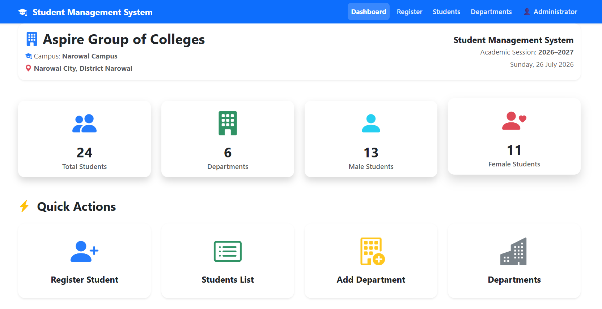
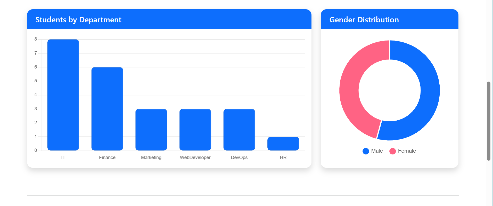
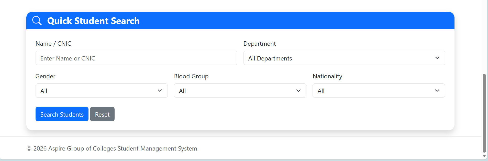
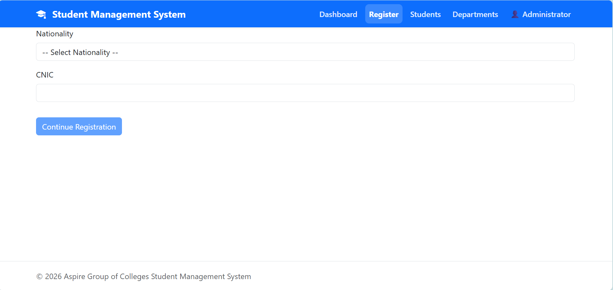
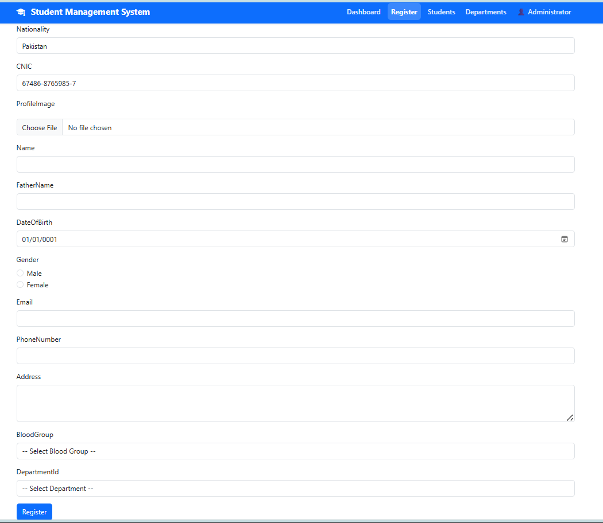
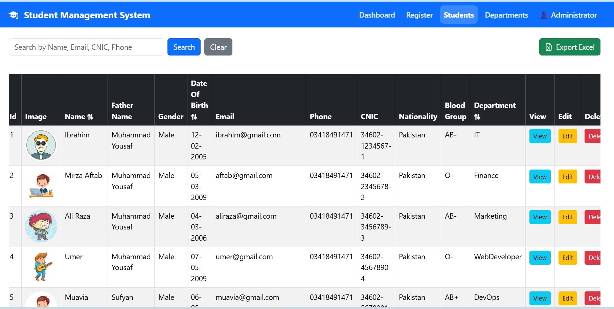
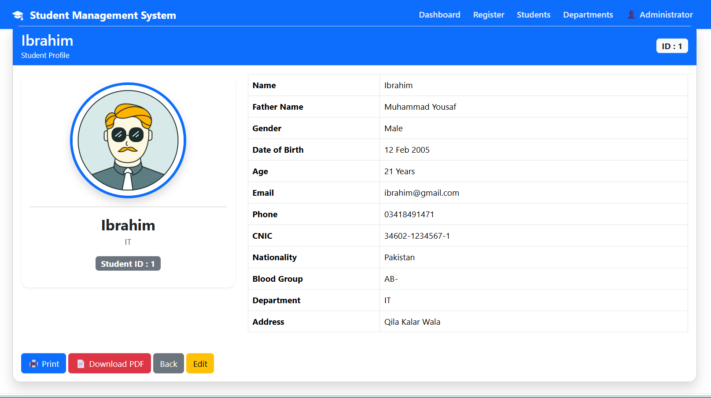
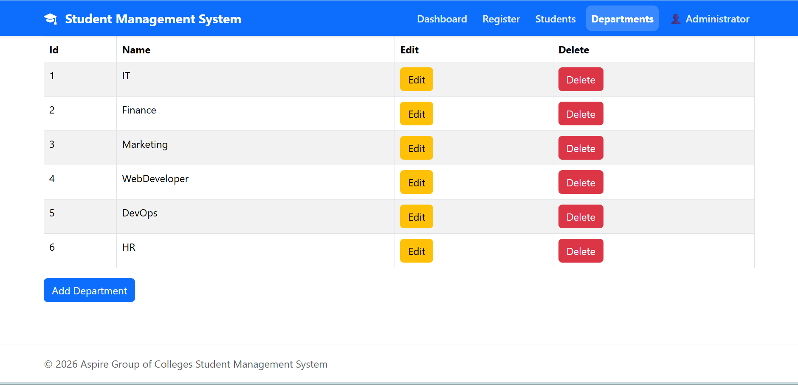

# 🎓 Student Management System


A modern **Student Management System** developed using **ASP.NET Core MVC (.NET 10)** and **Entity Framework Core**. The application provides an intuitive interface for managing students, departments, analytics, reports, and data exports.

---

# 📸 Application Screenshots

## Dashboard Overview

Displays the main dashboard with statistics cards and quick action shortcuts.



---

## Dashboard Analytics

Visualizes department-wise student distribution and gender analytics.



---

## Quick Student Search

Search students quickly using Name or CNIC.



---

## Student Verification

CNIC verification before allowing student registration.



---

## Student Registration

Complete student registration form with validation and profile image upload.



---

## Students List

Displays all registered students with search, edit, delete, print, PDF and Excel export features.



---

## Student Profile

Detailed profile page containing complete student information.



---

## Department Management

Manage academic departments and view department records.



---

# ✨ Features

## 📊 Dashboard

- Professional dashboard interface
- Student statistics cards
- Department analytics
- Gender distribution chart
- Quick action shortcuts
- Quick student search

## 👨‍🎓 Student Management

- Student verification using CNIC
- Student registration
- Edit student details
- Delete student records
- Student profile page
- Profile image upload
- Duplicate CNIC validation
- Duplicate email validation

## 🏫 Department Management

- Add new departments
- View departments
- Department-wise student statistics

## 📑 Reports & Export

- Print student details
- Export student profile to PDF
- Export student data to Excel

## 🔍 Search

- Search by student name
- Search by CNIC
- Fast filtering

---

# 🛠 Technologies Used

- ASP.NET Core MVC (.NET 10)
- C#
- Entity Framework Core
- SQL Server
- Bootstrap 5
- Chart.js
- QuestPDF
- ClosedXML
- JavaScript
- HTML5
- CSS3

---

# 📂 Project Structure

```text
StudentManagement
│
├── Controllers
├── Models
├── ViewModels
├── Views
├── Services
├── Data
├── Screenshots
├── wwwroot
├── Program.cs
└── appsettings.json
```

---

# 🚀 Getting Started

### Clone the repository

```bash
git clone https://github.com/mirza-aftab18/StudentManagement.git
```

### Open the project

Open the solution in **Visual Studio 2026**.

### Restore packages

Restore all NuGet packages.

### Configure Database

Update the SQL Server connection string inside:

```text
appsettings.json
```

### Apply Migrations

```powershell
Update-Database
```

### Run the Application

Press **F5** or click **Start** in Visual Studio.

---

# 🔮 Future Improvements

- Authentication & Authorization
- Role-Based Access Control
- Attendance Management
- Fee Management
- Email Notifications
- Student ID Card Generation
- Dashboard Enhancements

---

# 👨‍💻 Author

**Mirza Aftab**

- 🎓 BS Information Technology
- 💻 ASP.NET Core Developer

GitHub: https://github.com/mirza-aftab18

---

# ⭐ Support

If you found this project useful, consider giving it a **⭐ Star** on GitHub.
